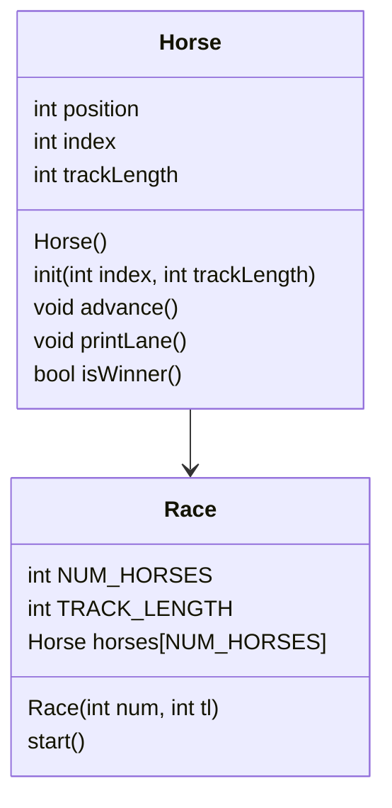

# CS121Project5
## UML

```mermaid
classDiagram
direction TB
    class Horse {
      int position
      int index
      int trackLength
      Horse()
      init(int index, int trackLength)
	    void advance()
	    void printLane()
	    bool isWinner()
    }

    class Race {
      int NUM_HORSES
      int TRACK_LENGTH
	    Horse horses[NUM_HORSES]

      Race(int num, int tl)
	    start()
    }

    Horse --> Race
```
